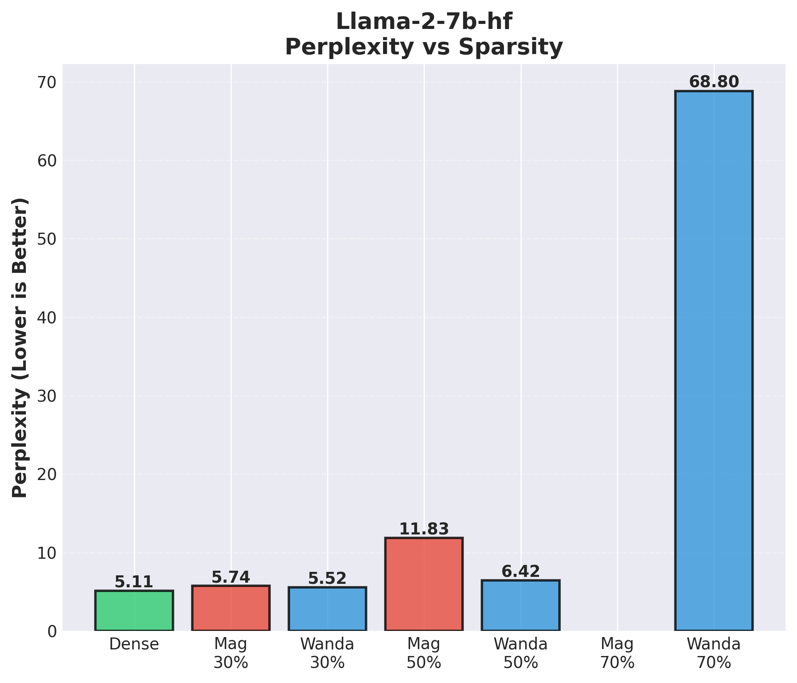
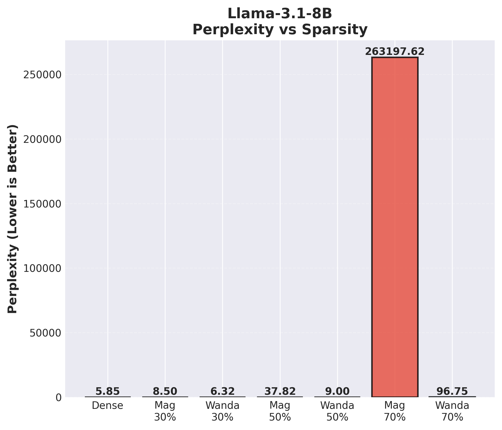
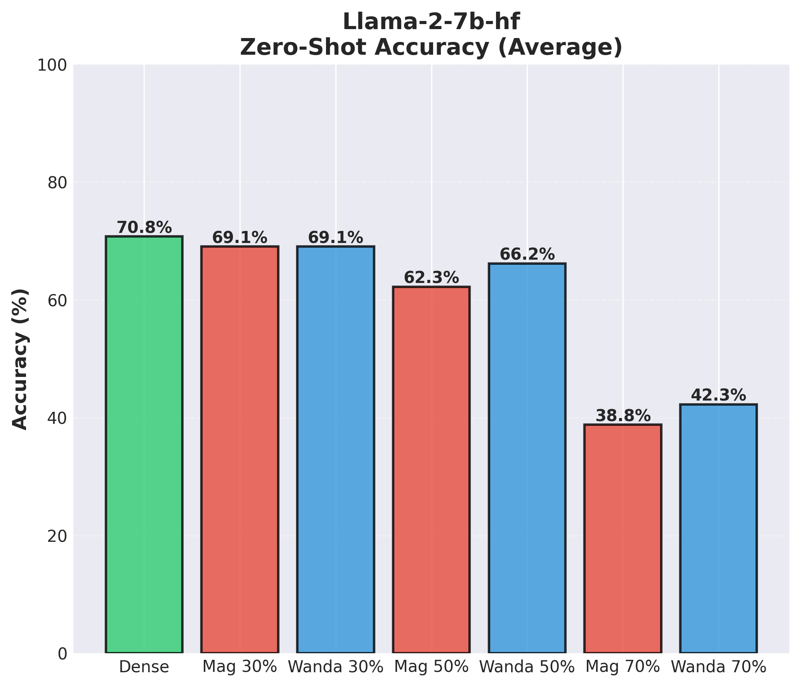
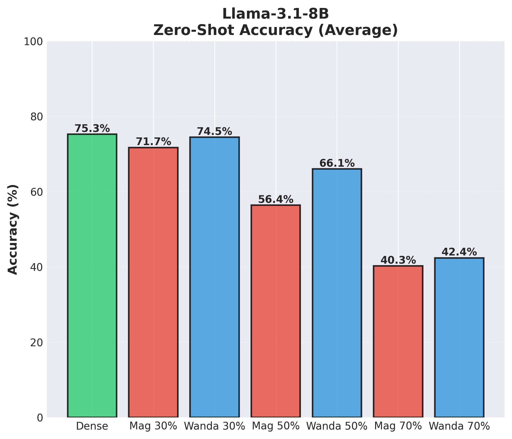
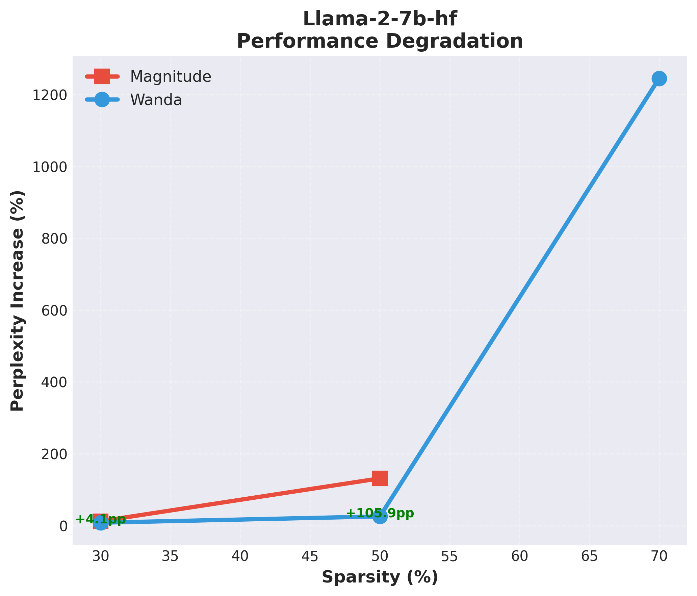
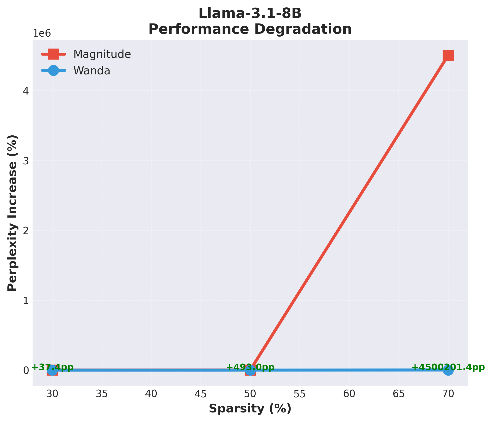
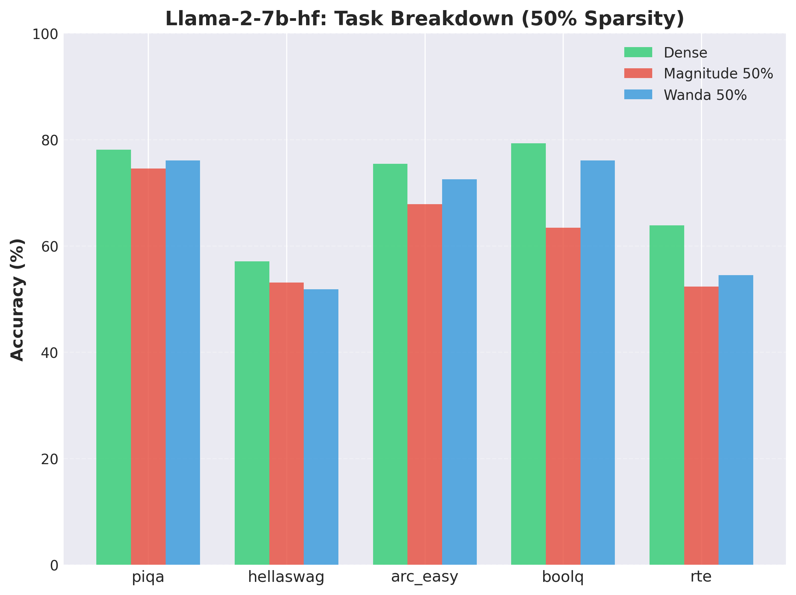
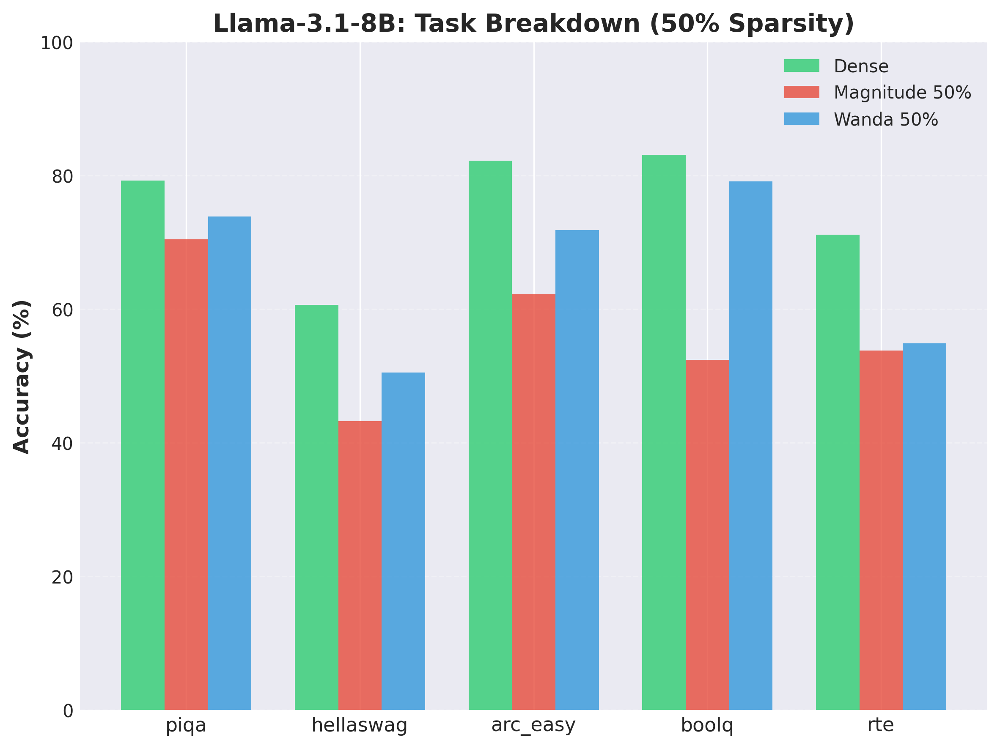
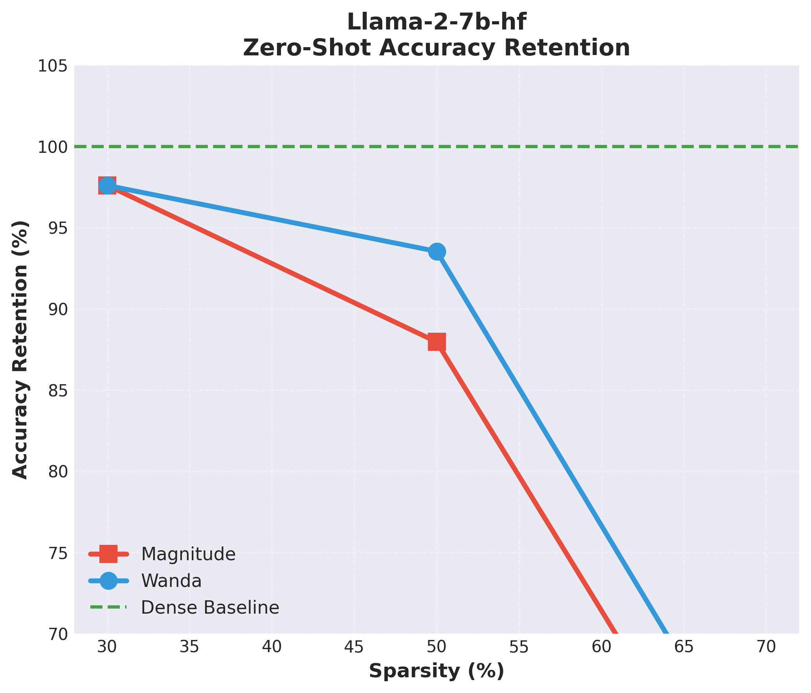
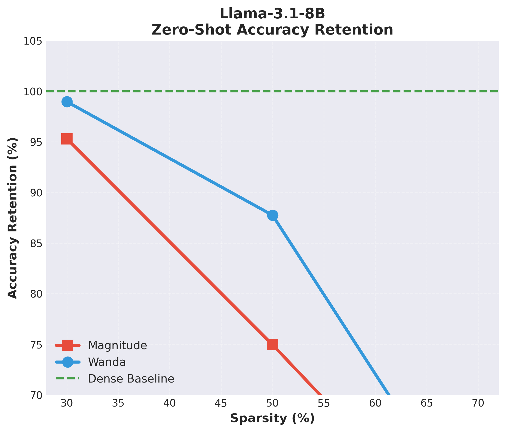

# 🪄 Wanda: Pruning Large Language Models with Weights AND Activations

<div align="center">


**A reproduction and extension of the Wanda pruning method for LLMs**

[Paper](https://arxiv.org/abs/2306.11695) • [Original Code](https://github.com/locuslab/wanda) • [Report](wanda_pruning_report.tex)

</div>

---

## 📋 Table of Contents

- [Overview](#-overview)
- [The Problem](#-the-problem)
- [The Wanda Approach](#-the-wanda-approach)
- [Key Results](#-key-results)
- [Experimental Setup](#-experimental-setup)
- [Results Analysis](#-results-analysis)
- [Comparison with Original Paper](#-comparison-with-original-paper)
- [Repository Structure](#-repository-structure)
- [How to Run](#-how-to-run)
- [Authors](#-authors)
- [References](#-references)

---

## 🎯 Overview

This project reproduces and validates the **Wanda (Weights AND Activations)** pruning method introduced by Sun et al. (2024) at ICLR. Wanda is a simple yet effective approach for pruning Large Language Models (LLMs) without requiring retraining or weight updates.

### Key Contributions

- ✔️ **Reproduced Wanda** on LLaMA-2-7B and LLaMA-3.1-8B
- ✔️ **Validated theoretical claims** with empirical experiments
- ✔️ **Extended evaluation** to newer model architectures
- ✔️ **Comprehensive analysis** of perplexity and zero-shot accuracy

---

## 🔥 The Problem

Large Language Models are powerful but **extremely expensive to deploy**:

| Challenge | Impact |
|-----------|--------|
| **Billions of parameters** | 7B model = 14GB+ GPU memory |
| **High inference cost** | Limits edge deployment |
| **Memory bandwidth** | Bottleneck for real-time applications |

### Traditional Solution: Magnitude Pruning

The simplest pruning approach removes weights with the smallest absolute values:

$$S_{\text{magnitude}}(w_{ij}) = |w_{ij}|$$

**Problem**: Weight magnitude alone doesn't determine importance! A small weight connected to a highly activated input may be more critical than a large weight on an inactive channel.

---

## 🪄 The Wanda Approach

Wanda addresses this by considering **both weights AND activations**:

$$S_{\text{Wanda}}(w_{ij}) = |w_{ij}| \cdot \|X_j\|_2$$

Where:
- $w_{ij}$ is the weight connecting input $j$ to output $i$
- $\|X_j\|_2$ is the L2 norm of activations at input channel $j$

### Key Properties

| Property | Description |
|----------|-------------|
| **One-shot** | No iterative pruning needed |
| **No retraining** | Prune and deploy immediately |
| **Per-row sparsity** | Uniform sparsity across output neurons |
| **Efficient** | Only needs 64-128 calibration samples |

### Algorithm

```
1. Forward pass with calibration data (64 samples)
2. For each linear layer:
   a. Compute activation norms ||X_j||_2 for each input channel
   b. Calculate importance: S = |W| * ||X||_2
   c. For each output row, prune lowest-scoring weights
3. Return sparse model (no weight updates)
```

---

## 📊 Key Results

### Perplexity Comparison (WikiText-2)

<table>
<tr>
<td align="center">

<br><b>LLaMA-2-7B</b>
</td>
<td align="center">

<br><b>LLaMA-3.1-8B</b>
</td>
</tr>
</table>

| Model | Sparsity | Magnitude | Wanda | Improvement |
|-------|----------|-----------|-------|-------------|
| LLaMA-2-7B | 30% | 5.74 | **5.52** | 3.7% ↓ |
| LLaMA-2-7B | 50% | 11.83 | **6.42** | **45.8%** ↓ |
| LLaMA-2-7B | 70% | NaN ❌ | **68.80** | ∞ |
| LLaMA-3.1-8B | 30% | 8.50 | **6.32** | 25.7% ↓ |
| LLaMA-3.1-8B | 50% | 37.82 | **9.00** | **76.2%** ↓ |
| LLaMA-3.1-8B | 70% | 263,197 | **96.75** | 99.96% ↓ |

> **Key Finding**: At 50% sparsity, Wanda achieves **45-76% better perplexity** than magnitude pruning.

### Zero-Shot Accuracy

<table>
<tr>
<td align="center">

<br><b>LLaMA-2-7B</b>
</td>
<td align="center">

<br><b>LLaMA-3.1-8B</b>
</td>
</tr>
</table>

| Model | Dense | Magnitude 50% | Wanda 50% | Accuracy Retained |
|-------|-------|---------------|-----------|-------------------|
| LLaMA-2-7B | 70.8% | 62.3% | **66.2%** | **93.5%** |
| LLaMA-3.1-8B | 75.3% | 56.4% | **66.1%** | **87.8%** |

> **Key Finding**: Wanda retains **+4pp** (LLaMA-2) and **+10pp** (LLaMA-3) more accuracy than magnitude pruning.

---

## ⚙️ Experimental Setup

### Models

| Model | Parameters | Layers | Hidden Dim |
|-------|------------|--------|------------|
| LLaMA-2-7B | 6.7B | 32 | 4096 |
| LLaMA-3.1-8B | 8.0B | 32 | 4096 |

### Configuration

```yaml
Calibration:
  Dataset: WikiText-2 (train split)
  Samples: 64
  Sequence Length: 4096

Sparsity Levels: [30%, 50%, 70%]

Evaluation:
  Perplexity: WikiText-2 (test split)
  Zero-Shot: PIQA, HellaSwag, ARC-Easy, BoolQ, RTE

Hardware: NVIDIA L40S (48GB)
```

### Implementation Details

- **Framework**: PyTorch + HuggingFace Transformers
- **Pruning**: Layer-by-layer with forward hooks
- **Sparsity**: Unstructured, per-output-row allocation
- **Precision**: FP16 inference

---

## 📈 Results Analysis

### Degradation Analysis

<table>
<tr>
<td align="center">

<br><b>LLaMA-2-7B Degradation</b>
</td>
<td align="center">

<br><b>LLaMA-3.1-8B Degradation</b>
</td>
</tr>
</table>

### Per-Task Zero-Shot Breakdown (50% Sparsity)

<table>
<tr>
<td align="center">

<br><b>LLaMA-2-7B Tasks</b>
</td>
<td align="center">

<br><b>LLaMA-3.1-8B Tasks</b>
</td>
</tr>
</table>

### Accuracy Retention

<table>
<tr>
<td align="center">

<br><b>LLaMA-2-7B Retention</b>
</td>
<td align="center">

<br><b>LLaMA-3.1-8B Retention</b>
</td>
</tr>
</table>

### Key Observations

1. **Wanda consistently outperforms magnitude pruning** at all sparsity levels
2. **Advantage scales with sparsity**: 3.7% at 30% → 76.2% at 50%
3. **Numerical stability**: Wanda produces valid outputs where magnitude fails (NaN at 70%)
4. **LLaMA-3 is more sensitive**: Newer models use parameters more efficiently, making naive pruning more harmful

---

## 🔬 Comparison with Original Paper

| Metric | Original Paper (LLaMA-7B) | Our Reproduction (LLaMA-2-7B) |
|--------|---------------------------|-------------------------------|
| Dense PPL | 5.68 | 5.11 |
| Magnitude 50% PPL | 17.29 | 11.83 |
| Wanda 50% PPL | 7.26 | **6.42** |
| Improvement | 58% | **45.8%** |

✔️ **Same trend confirmed**: Wanda dramatically outperforms magnitude pruning  
✔️ **Reproducible**: Results consistent across model generations  
✔️ **Validated**: Core claims from the paper hold on newer architectures

---

## 📁 Repository Structure

```
wanda-prunning-experiment/
├── 📓 wanda-prunning-experiment.ipynb  # Main experiment notebook
├── 📄 wanda_pruning_report.tex         # Full LaTeX report
│
├── 📁 results_llama2/                   # LLaMA-2-7B results
│   ├── 1_perplexity_comparison.png
│   ├── 2_degradation.png
│   ├── 3_zero_shot_summary.png
│   ├── 4_task_breakdown_*.png
│   ├── 7_accuracy_retention.png
│   ├── perplexity_results.csv
│   └── zero_shot_results.csv
│
└── 📁 results_llama3/                   # LLaMA-3.1-8B results
    ├── (same structure as llama2)
    └── ...
```

---

## 🚀 How to Run

### Prerequisites

```bash
pip install torch transformers datasets accelerate lm-eval matplotlib pandas
```

### Running the Experiment

1. **Open the notebook**:
   ```bash
   jupyter notebook wanda-prunning-experiment.ipynb
   ```

2. **Set your HuggingFace token** (required for LLaMA access):
   ```python
   HF_TOKEN = "your_token_here"
   ```

3. **Run all cells** to reproduce experiments

### GPU Requirements

| Model | Minimum VRAM | Recommended |
|-------|--------------|-------------|
| LLaMA-2-7B | 16GB | 24GB |
| LLaMA-3.1-8B | 20GB | 48GB |

---

## 👥 Authors

<table>
<tr>
<td align="center">
<b>Zineb ABERCHA</b><br>
Mohammed VI Polytechnic University
</td>
<td align="center">
<b>Omar Alfarouq BOUHADI</b><br>
Mohammed VI Polytechnic University
</td>
</tr>
</table>

**Supervisor**: Prof. Hamza KEURTI

**Course**: CSCI-B-M315 - Advanced AI Topics

**Date**: January 2026

---

## 📚 References

```bibtex
@inproceedings{sun2024wanda,
  title={A Simple and Effective Pruning Approach for Large Language Models},
  author={Sun, Mingjie and Liu, Zhuang and Bair, Anna and Kolter, J Zico},
  booktitle={International Conference on Learning Representations (ICLR)},
  year={2024}
}
```

### Related Work

- [SparseGPT](https://arxiv.org/abs/2301.00774) - One-shot pruning with weight reconstruction
- [LLM-Pruner](https://arxiv.org/abs/2305.11627) - Structured pruning for LLMs
- [GPTQ](https://arxiv.org/abs/2210.17323) - Post-training quantization